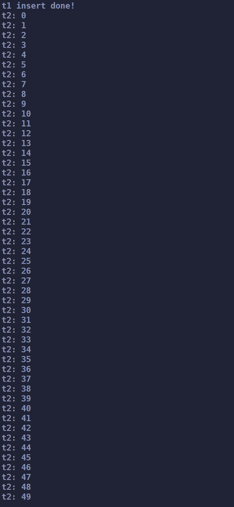

# ConcurrentQueue
将大佬的高性能并发队列进行拆分并加上详细注释。
此项目会慢慢加上详细注释，现在正在写关于这个项目的博客，会详细的剖析这个并发队列的底层原理。    
将此项目编译为静态库和动态库两种，使用cmake进行编译。如果你现在使用的正是cmake项目,那么将库文件加入进来，使用```target_link_libraries```就大功告成.


## 测试代码
``` cpp
#include "concurrent_queue_impl.h"  // 一定要引用这个头文件,其他都不需要
#include <iostream>
#include <thread>

using namespace std;

int main()
{
    ConcurrentQueue<int> conqueue;
    bool exit = false;
    
    std::thread t1([&]{
        for (int i = 0; i < 50; i++)
            conqueue.Enqueue(i);
        cout << "t1 insert done!\n";
    });

    std::thread t2([&]{
        int ret = 0;
        while (conqueue.TryDequeue(ret))
            cout << "t2: " << ret << "\n";
        exit = true;
    });
    
    t1.join();
    t2.join();

    while (!exit);
    return 0;
}
```
    
执行结果:   
